# 🏗 Scaffold-ETH - 🔑 Meta multi sig wallet.


Hi, to all! The objective of this topic is to build a multisig wallet that receives meta-transactions and execute signed transactions. A meta-transaction is a regular Ethereum transaction which contains another transaction, the actual transaction. The actual transaction is signed by a user or a group of users and then sent to an operator (any wallet that can execute transactions); no gas and blockchain interaction required. The operator takes this signed transaction and submits it to the blockchain paying for the fees himself. The forwarding smart contract ensures there is a valid signature on the actual transaction and then executes it.

---

## 📚 High level aproach.

In a high level approach we can understand the multisig wallet as a locked chest where the lock can have multiple keyholes and we need to fit all of them to open it. We can have more keys than keyholes if we want, we are going to program it as we want, awesome isn't it?

<p align="center" >
 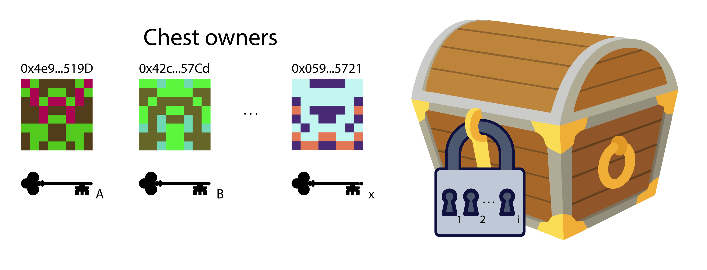
</p>

To delve more into technicalities we are going to treat the 'x' keys as the multisig wallet owners private keys, and the 'i' keyholes as the `signaturesRequired` design parameter that represent the number of signatures required to open the chest.

---

## 🧠 Aplication description.

The application consists, first of all, of a smart contract stored on the blockchain (On-Chain) that receives a metatransaction (containing enough data to execute the actual transaction "Tx" and a set of signatures) and verifies the signatures and executes the actual transaction.
Secondly, of a front-end (Off-Chain) who sign the actual transaction, build the metatransaction and calls the MultiSigWallet contract.

below is shown a schema that describes the parts of the aplication and how it interact.

<p align="center" >
 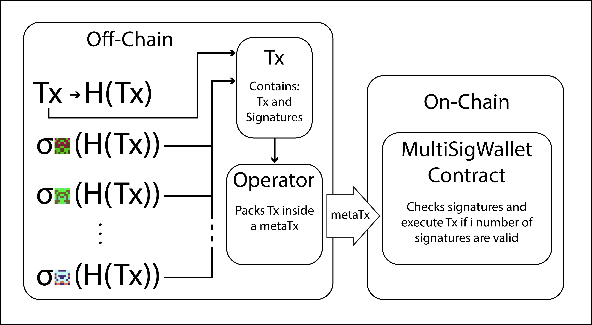
</p>

---

## 🛠 Let's buidl it!

We are going to use the scaffold-eth project.

Required: [Node](https://nodejs.org/en/) plus [Yarn](https://classic.yarnpkg.com/lang/en/docs/install/) and [Git](https://git-scm.com/downloads)

```
git clone https://github.com/scaffold-eth/scaffold-eth-examples meta-multi-sig-v2
```
```
cd meta-multi-sig-v2
git checkout meta-multi-sig-v2
yarn install
yarn start
```

> in a second terminal window, start your 📱 frontend:

```
cd meta-multi-sig-v2
yarn chain
```

> in a third terminal window, 🛰 deploy your contract:

```
cd meta-multi-sig-v2
yarn deploy
```

📱 Open http://localhost:3000 to see the app

### Chest main panel

Within the tab called "AppHome" we first find a panel that shows the status of the multisig contract, here we can see the address of the contract, the signatures required to validate a transaction, the balance of the contract and a record of events emited by the contract. 

> Check how the panel works by reading the code in /packages/react-app/src/views/Home.jsx, feel free to customize it however you like.

<p align="center" >
 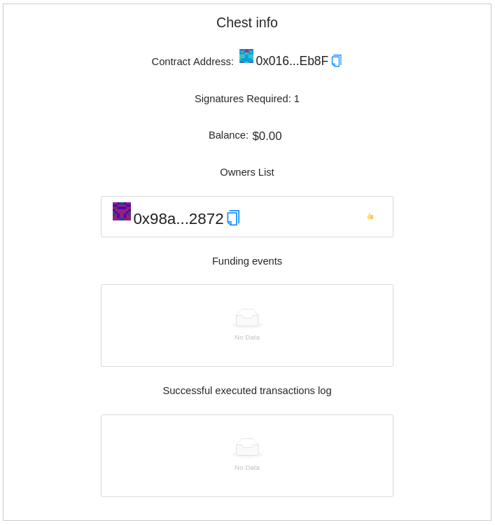
</p>


> You can take the onwership of the chest during deployment editing the deployment script /packages/hardhat/deploy/00_deploy_meta_multi_sig_wallet.js.

<p align="center" >
 
</p>

> You can also fund the chest uncommenting the funding lines in the same script. Set as many ethers as you want.

<p align="center" >
 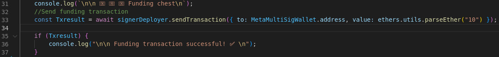
</p>

> 🛰 deploy your contract again:

```
yarn deploy --reset
```

if you have followed these steps correctly, you should see your frontend address as an  owner of the contract, and the contract balance updated. Now that you have the multisig under your ownership and founded you can send meta transactions to it to spend those funds.

### Sign and execute TX

In order for the contract to properly validate the transaction, we need to calculate the hash of that transaction and sign it with the owner's address (in this case, only one signature is needed because we only have one owner on the contract).

> Go to TX Hash Calculator and add the tx info, let the calldata field as 0x we are going to explain later about it, click on Calculate Hash and copy the generated hash.

<p align="center" >
 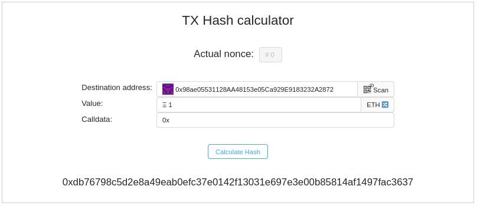
</p>

> Go to TX Hash signer, paste the previously calculated hash, click on Sign and copy the generated signature.

<p align="center" >
 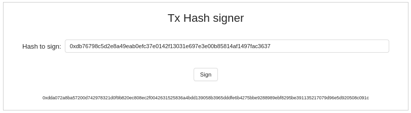
</p> 

> Go to Execute Transaction and add the tx info(has to match the tx of the previous computed hash), click on Render signatures input to show the signatures input fields, copy the previously calculated signature and click Execute Tx.

<p align="center" >
 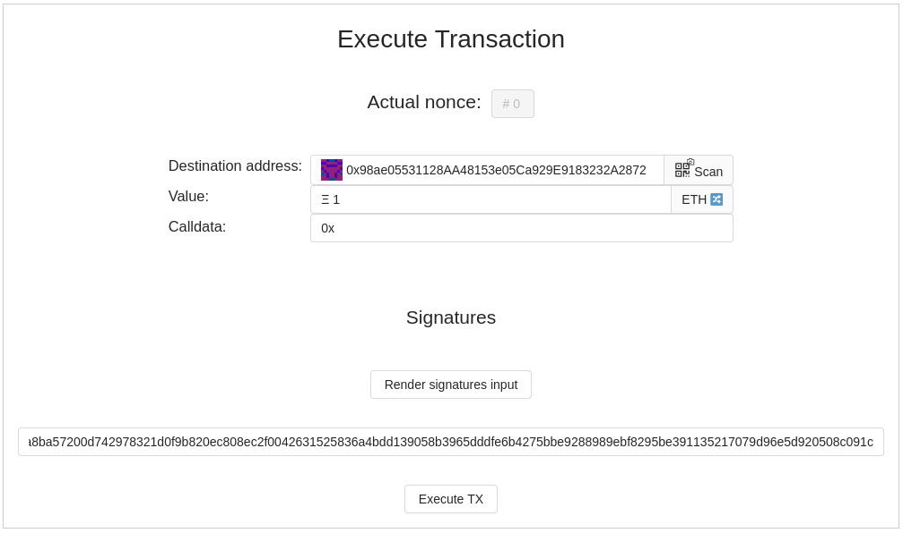
</p>

You will see that the destination address wallet will receive de funds from the chest. Checkout how the frontend works looking the code  in /packages/react-app/src/views/Home.jsx.

###  Ownership control

By introducing additional logic in the contract along with the fact that we can customize the calldata in the transaction and call functions in this or other contracts, we can control the wallet parameters such as the list of owners and the variable of required signatures.

The first 4 bytes of the call data are the function selector, these bytes are followed by the function parameters in abi encoding. So let's add functions to our multisig to control ownership and modify the required signatures parameter.

> Edit /packages/hardhat/contracts/MetaMultiSigWallet.sol and uncoment the ownership control functions

<p align="center" >
 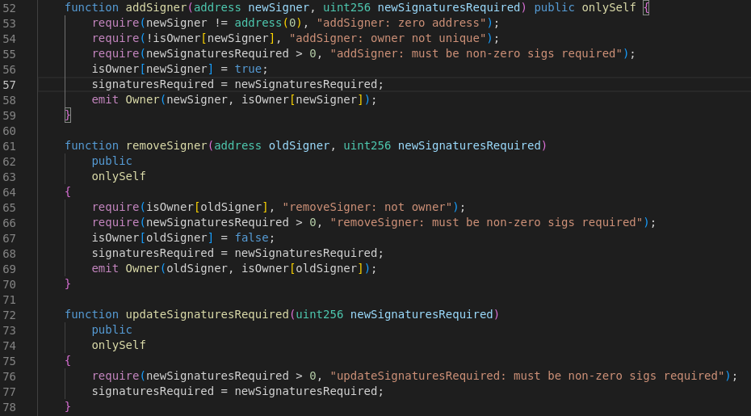
</p>

> 🛰 deploy your contract again:

```
yarn deploy --reset
```

L'ets add another signer to the wallet!

> 🔥 We'll use burner wallets on by opening a new incognito window and navigate it to http://localhost:3000. You'll notice it has a new wallet address in the top right. whe are going to add this wallet as signer.

<p align="center" >
 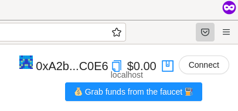
</p>

> copy this address and return to normal browser window, now go to calldata calculator and input the function signature with parameters to calculate the calldata that you have to include in the transaction

<p align="center" >
 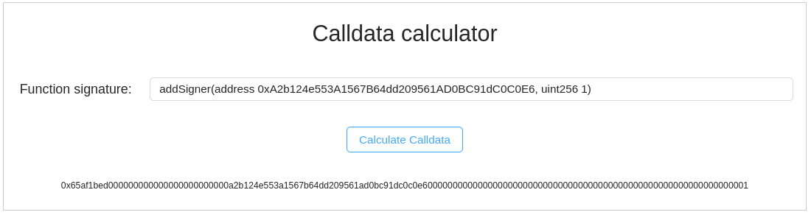
</p>

> repeat the Sign and execute TX steps but now include the calculated calldata

<p align="center" >
 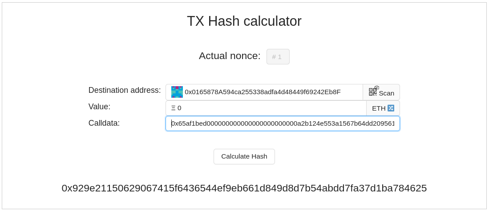
</p>

You can now see in the panel that the incognito wallet address is added as a singer, you can use these steps to execute any function of any contract. Try now to execute another function, remove the burnable wallet as signer maybe? 

<p align="center" >
 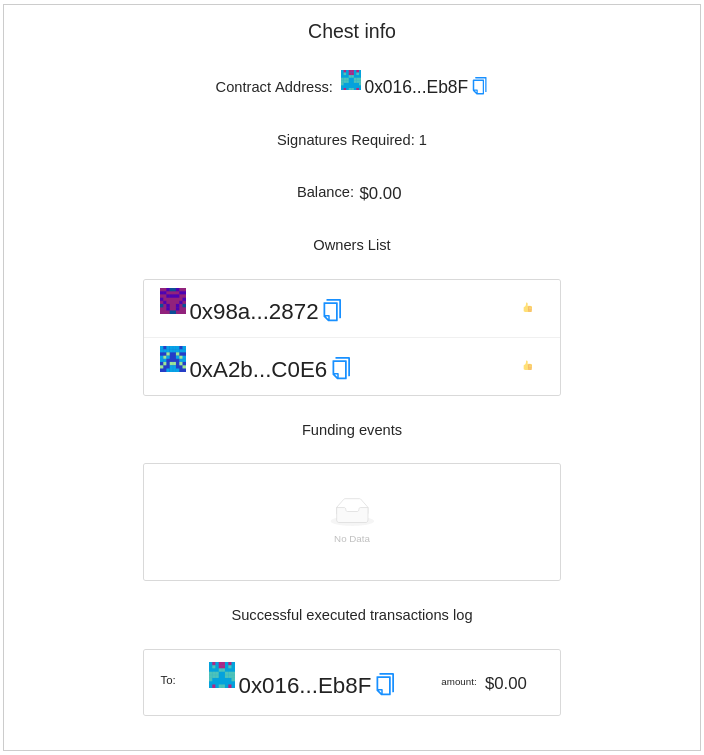
</p>

---

## 📡 Deploy the wallet!

🛰 Ready to deploy to a public testnet?!?

> Change the `defaultNetwork` in `packages/hardhat/hardhat.config.js` to `rinkeby`

<p align="center" >
 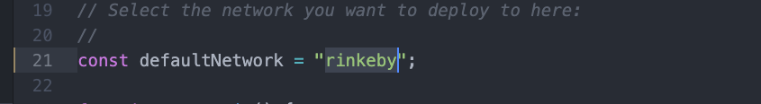
</p>


🔐 Generate a **deployer address** with `yarn run generate`

<p align="center" >
 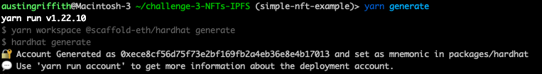
</p>


👛 View your **deployer address** using `yarn account` 

<p align="center" >
 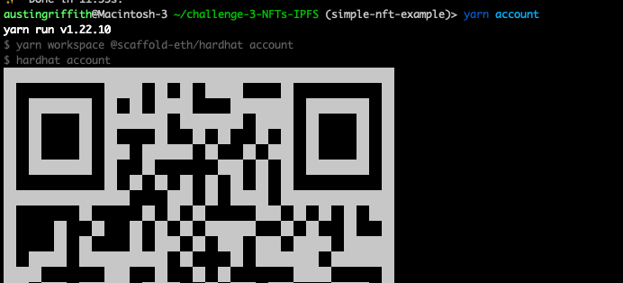
</p>

⛽️ Use a faucet like [faucet.paradigm.xyz](https://faucet.paradigm.xyz/) or [rinkebyfaucet.com](https://www.rinkebyfaucet.com/) to fund your **deployer address**.


```sh
yarn deploy
```


# Checkpoint 4: 🚢 Ship it! 🚁

> ✏️ Edit your frontend `App.jsx` in `packages/react-app/src` to change the `targetNetwork` to `NETWORKS.rinkeby`:

<p align="center" >
 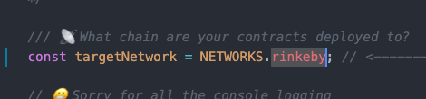
</p>

You should see the correct network in the frontend (http://localhost:3000):

<p align="center" >
 
</p>


📦 Build your frontend:

```sh
yarn build
```

💽 Upload your app to surge:
```sh
yarn surge
```
(You could also `yarn s3` or maybe even `yarn ipfs`?)

>  😬 Windows users beware!  You may have to change the surge code in `packages/react-app/package.json` to just `"surge": "surge ./build",`
⚙ If you get a permissions error `yarn surge` again until you get a unique URL, or customize it in the command line. 

> 👩‍❤️‍👨 Share your public url with friends, add signers and send some tasty ETH to a few lucky ones 😉!!
