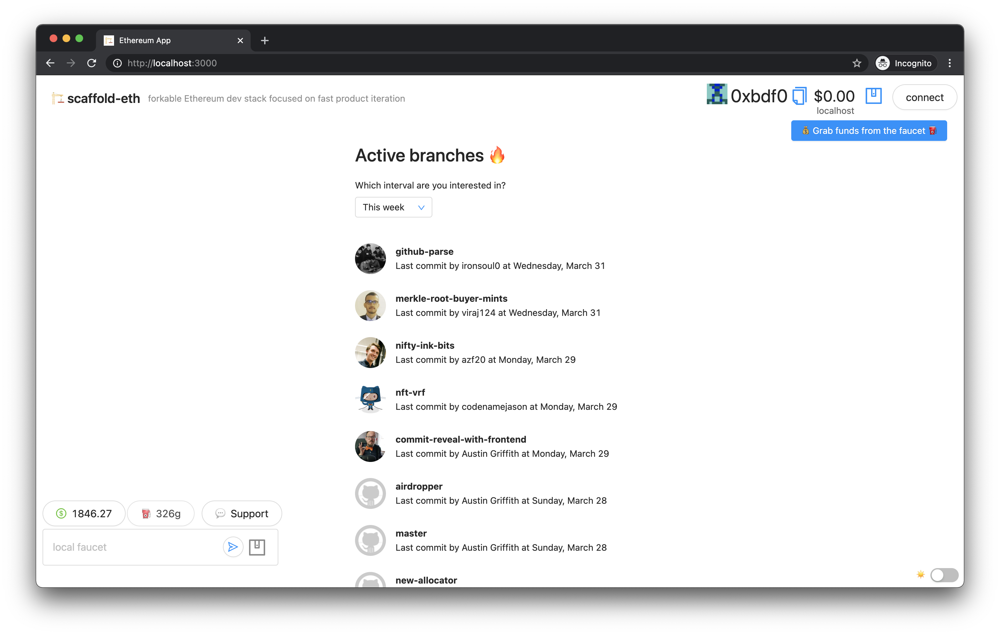

<h1 align="center">
   Active Branches 🔥
</h1>



## 💻 Wanna run on your machine?

1. [Generate](https://github.com/settings/tokens) Github Personal Access Token

2. Create `.env` file in `packages/react_app` and insert the following
   ```sh
   REACT_APP_GITHUB_TOKEN=YOUR_TOKEN
   ```