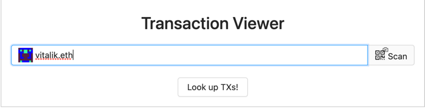
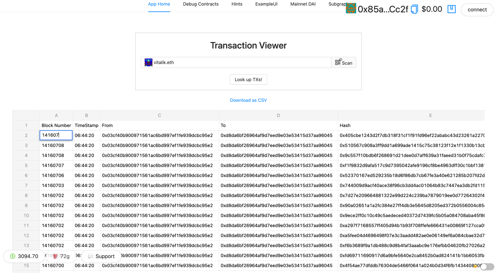
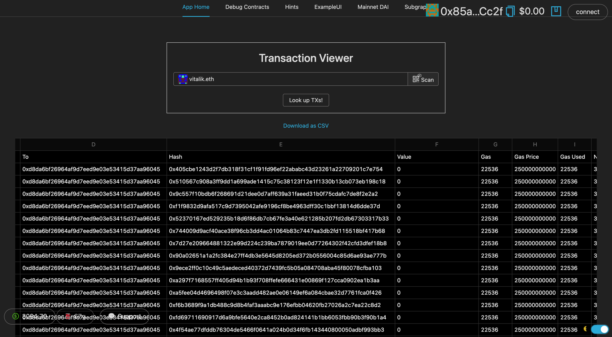

# 🏗 Scaffold-ETH - Etherscan Spreadsheet Starter

> Turn the transactions from the Etherscan API into Spreadsheet 🚀

# 🏄‍♂️ Quick Start

Prerequisites: [Node](https://nodejs.org/en/download/) plus [Yarn](https://classic.yarnpkg.com/en/docs/install/) and [Git](https://git-scm.com/downloads)

> clone/fork 🏗 scaffold-eth:

```bash
git clone https://github.com/scaffold-eth/scaffold-eth-examples.git etherscan-spreadheet-starter

cd etherscan-spreadheet-starter

git switch etherscan-spreadheet-starter
```

> create an Etherscan account and add your api key to packages\react-app\src\constants.js

```
export const ETHERSCAN_KEY = "YOURAPIKEY";
```

> in a terminal window, start your 📱 frontend:

```bash
yarn start
```
> check out all the Etherscan endpoints listed in

```
packages\react-app\src\hooks\EtherscanAPI.js
```

📝 Edit your frontend `TxViewer.jsx` in `packages/react-app/src/views/`

📱 Open http://localhost:3000 to see the app

# How to Use

> enter your address and click Look Up TXs:



> look through the TXs and edit online in the Spreadsheet:



> download as CSV whenever you are ready!
 


# 💬 Support Chat

Join the telegram [support chat 💬](https://t.me/joinchat/KByvmRe5wkR-8F_zz6AjpA) to ask questions and find others building with 🏗 scaffold-eth!
