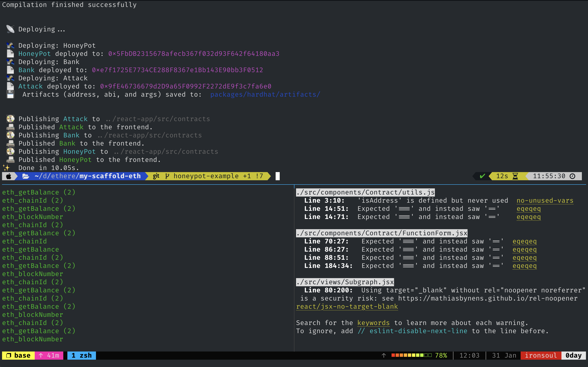
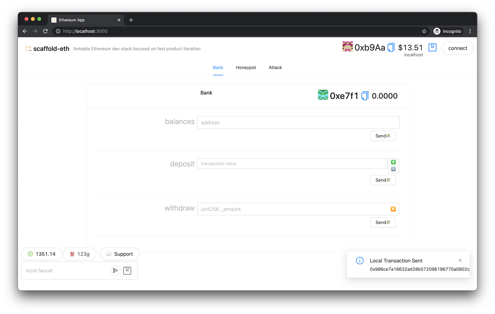
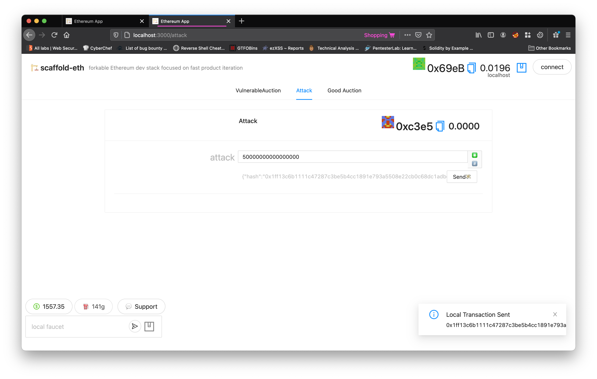
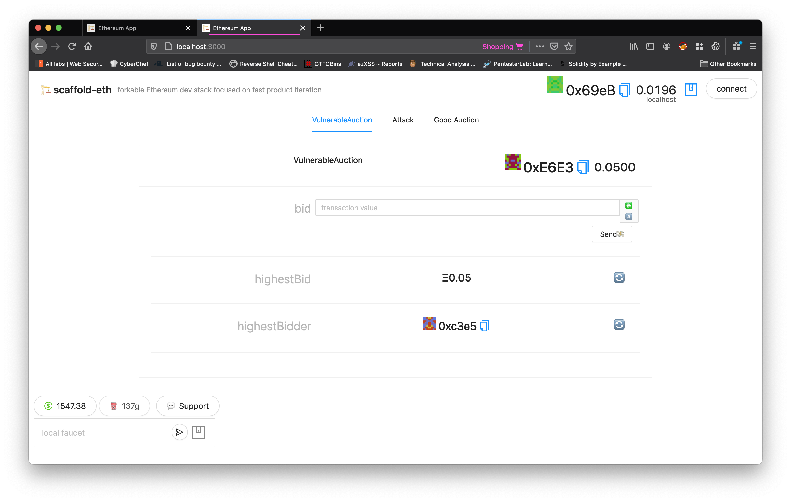
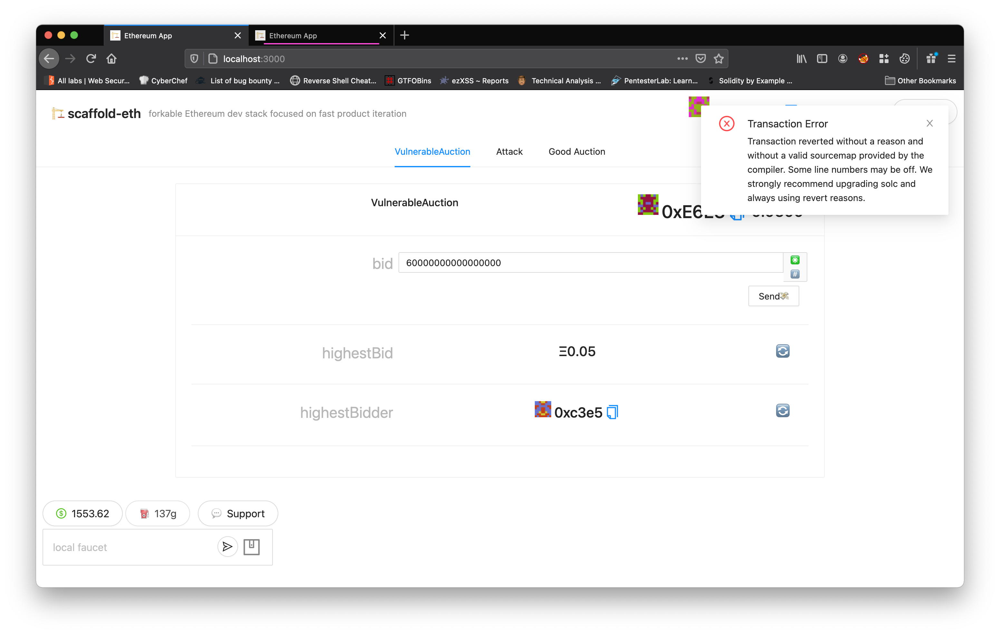

# 🕷️🏗 scaffold-eth - Denial of Service

> Make contract unusable by exploiting push external calls 😈

---

<details open="open">
  <summary>Table of Contents</summary>
  <ol>
    <li>
      <a href="#about-the-project">About The Project</a>
    </li>
    <li>
      <a href="#getting-started">Getting Started</a>
      <ul>
        <li><a href="#prerequisites">Prerequisites</a></li>
        <li><a href="#installation">Installation</a></li>
      </ul>
    </li>
    <li><a href="#usage">Exploring smart contracts</a></li>
    <li><a href="#usage">Attack vector</a></li>
    <li><a href="#usage">Practice</a></li>
    <li><a href="#prevention">Prevention</a></li>
    <li><a href="#contributing">Additional resources</a></li>
    <li><a href="#contact">Contact</a></li>
  </ol>
</details>

## About The Project

This little side quest will allow you to explore the concept of "Denial of Service". 

One exploit we introduce here is denial of service by making the function to send Ether fail.

## Getting Started

### Prerequisites

You should be familiar with [calls](https://solidity-by-example.org/call/) and [reverts](https://medium.com/blockchannel/the-use-of-revert-assert-and-require-in-solidity-and-the-new-revert-opcode-in-the-evm-1a3a7990e06e).

### Installation

Let's start our environment for tinkering and exploring how "DoS attack" works.

1. Clone the repo first
```sh
git clone -b https://github.com/austintgriffith/scaffold-eth.git denial-of-service-example
cd denial-of-service-example
```

2. Install dependencies
```bash
yarn install
```

3. Start your React frontend
```bash
yarn start
```

4. Spin up your local blockchain using [Hardhat](https://hardhat.org/)
```bash
yarn chain
```

5. Deploy your smart contracts to a local blockchain
```bash
yarn deploy
```

<b>Pro Tip: </b> Use [tmux](https://linuxize.com/post/getting-started-with-tmux/) to easily start all commands in a single terminal window!

This is how it looks like in my terminal:



If everything worked fine, you have to have something like this opened in your browser:



## Smart contracts

Let's navigate to `packages/hardhat/contracts` folder and check out what contracts we have there.

### VulnerableAuction.sol

This smart contract will become unusable once we exploit it. 

The logic is pretty straightforward:

```solidity
function bid() payable external {
  require(msg.value >= highestBid);

  if (highestBidder != address(0)) {
    (bool success, ) = highestBidder.call.value(highestBid)("");
    require(success); 
  }

    highestBidder = msg.sender;
    highestBid = msg.value;
}
```

Smart contract immitates auction by keeping track of the highest bid made. If you want to become a `highestBidder` you have to send ETH greater than the previous `highestBid`.

Try to find a way to exploit this contract (make it unusable) before reading further.

### Attack.sol

Our contract for exploitation. 

Note that this block of code is commented in the contract.

```solidity
function () external payable {
  assert(false);
}
```

Try to guess why :)

## Attack vector

The attack we are going to do is called `DoS with (Unexpected) revert`. So how does it work?

Basically, If attacker bids using a smart contract which has a fallback function that reverts any payment, the attacker can win any auction. 

When it tries to refund the old leader, it reverts if the refund fails. This means that a malicious bidder can become the leader while making sure that any refunds to their address will always fail. In this way, they can prevent anyone else from calling the `bid()` function, and stay the leader forever.

This is why part with `fallback()` was commented in our `Attack.sol`.

## Practice

Let's use our awesome frontend provided by `scaffold-eth` to make sure our assumption works fine. 

Run two different sessions. One will be for a simple user and one will be for an evil hacker.

This is how it looks like for me:


My first tab is for a simple user and second tab is for a hacker.

Let's make an initial bid and become a highestBidder as a simple user.


Now let's run our `attack` method as an attacker and disable our `VulnerableAuction` forever!



Seems we became a new `highestBidder`.



Now simple user can not become a new `highestBidder` even though he puts more ETH that we did.



## Prevention

In order to mitigate this attack, we have to `favor pull over push for external calls`.

This is demonstrated nicely in `GoodAuction.sol`. Note how we added a new method `withdrawRefund`. Now we do not depend on any push external calls like sending money back to someone.

```solidity
function withdrawRefund() external {
    uint refund = refunds[msg.sender];
    refunds[msg.sender] = 0;
    (bool success, ) = msg.sender.call.value(refund)("");
    require(success);
}
```

Using this we are no longer vulnerable!

## Additonal resources

* [Consensys Known Attacks](https://consensys.github.io/smart-contract-best-practices/known_attacks/#dos-with-unexpected-revert)

## Contact

Join the [telegram support chat 💬](https://t.me/joinchat/KByvmRe5wkR-8F_zz6AjpA) to ask questions and find others building with 🏗 scaffold-eth!