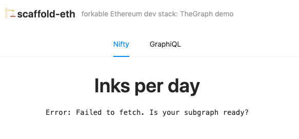

# The Graph <> scaffold-eth

## Introduction
This is a [scaffold-eth](https://github.com/austintgriffith/scaffold-eth) branch demonstrating [The Graph](https://thegraph.com/)'s subgraph functionality. The Graph aggregates contract events into structured data accessible via graphQL, reducing the need for complicated on-chain eth_calls in your frontend Dapp. In this example, we will spin up a new subgraph from scratch using [nifty.ink](https://nifty.ink) contract data.

## Set up
NOTE that you need to have Docker set up to run the local Graph node. Go [install Docker](https://www.docker.com/products/docker-desktop) now if you haven't got it already.

First step you're going to want to clone to the [graph-dev branch of scaffold-eth](https://github.com/austintgriffith/scaffold-eth/tree/graph-dev):
```
git clone -b graph-dev https://github.com/austintgriffith/scaffold-eth.git graph-dev
cd graph-dev
```
Install all of the relevant Node modules (make sure you are on Node version "^10.12.0 || >=12.0.0"!)
```
yarn install
```
Then you want to get a local graph node up and running. We're going to be running the docker image (this is what you need Docker for!)
```
cd docker/graph-node
docker-compose up
```
You should see a bunch of logs in the terminal as this node gets going!
_Note: We are looking at the xDai chain, as that is where nifty.ink is deployed. If you want to look at a different EVM chain, you can update docker-compose.yml file. For example you can swap out https://dai.poa.network for http://host.docker.internal:8545 to look at a local chain running on port 8545_

Then fire up the frontend in a new terminal:
```
cd graph-dev
yarn start
```
You should see an app, with an error message (for now!)



So you've got the usual `packages/react-app`, that's what is running on localhost://3000. There are two tabs:
- `Nifty`: here there will be some data from our subgraph when we make it (don't worry if there is an error for now, that is expected - you don't have a graph to get data from!)
- `GraphiQL`: this is an interface for writing custom queries against your subgraph

The hot new thing is in the `packages/subgraph`. This is where you define the configuration for your subgraph. You can then take that configuration and deploy it onto a Graph Node, and the Graph Node will give you back a fully functional graphQL endpoint.

## Creating a subgraph
So let's get to it! As an example, we'll be creating a subgraph that captures data from nifty.ink
You need four things to create a subgraph:
- `abis/` the ABIs for any contract(s) that you want to get data from - this is "raw material" for the files which you have to define…
- `schema.graphql` defines the structure of the dataset you want to create
- functions that map blockchain events (or calls or blocks) to your dataset, defined above - in this case they are stored in one file called `src/mapping.ts`
- `subgraph.yaml` - this ties together your schema with chain and contracts that the graph should be listening to, the events you want to track and how they should be handled (by the functions defined above)

### schema.graphql
Let's start with the schema. We are interested in knowing about all the inks that artists are creating on nifty.ink, so we have defined an `Ink` entity, and an `Artist` entity. We also want to know how many of each of these were created each day - the `DayTotal` entity. You can refer to [The Graph's docs for more details](https://thegraph.com/docs/define-a-subgraph), but there are several really nice things to call out here:
- Nested types - we are able to nest an Artist within our Ink object, which will then let us easily access artist attributes from the ink. When creating the mapping, we just have to pass the "Id" for the relevant artist
- Derived fields - when we created the Artist object on the Ink, that then lets us easily create an array of associated inks on the Artist object, all in the schema itself. A thing of beauty.

With our schema defined, in packages/subgraph we can run:
```
cd packages/subgraph
yarn codegen
```
This combines the ABIs with our schema to create some of the auto-generated files that we need.

### src/mapping.ts
Onto the mapping! This file holds the functions that take events from our contract, and turn them into our structured data. There is much more detail in [the documentation](https://thegraph.com/docs/assemblyscript-api) of course, but roughly speaking you need to:
- Import any assembly script helpers you need from graph-ts
- Import any contract or events from the autogenerated files
- Import any entities from your schema
- Define the functions to handle events or contract calls

These handler functions have a load of data available to them - the event data, the block information etc. Your role is to simply take that, and to add it to your data store appropriately. The key pattern here is load() and save(), where you can load an entity from the datastore by searching for it by its ID, make any changes and then save it back to the datastore, which will over-write the entity with the new information. If there is no existing entity, you can create a new one instead.

In our example we are only handling one event, the "new ink" event, but we are doing quite a few things:
- creating a new ink
- creating a new artist if appropriate
- incrementing the number of new inks or artists that day

### subgraph.yaml
Here you specify the schema, and the datasources for our subgraph. Our only datasource is the NiftyInk contract, on the xDai chain. We indicate the startBlock, so we don't have to scan all of history every time. Then we add the mappings we want to use for this datasource. In our case the key here is that we want the `handlenewInk` function to be used when we see the `newInk` event
```
- kind: ethereum/contract
  name: NiftyInk
  network: xdai
  source:
    address: "0x49dE55fbA08af88f55EB797a456fdf76B151c8b0"
    abi: NiftyInk
    startBlock: 11296637
  mapping:
    kind: ethereum/events
    apiVersion: 0.0.4
    language: wasm/assemblyscript
    entities:
      - Ink
      - Artist
    abis:
      - name: NiftyInk
        file: ./abis/NiftyInk.json
    eventHandlers:
      - event: newInk(uint256,indexed address,string,string,uint256)
        handler: handlenewInk
    file: ./src/mapping.ts
```

All you need to do here is to run:
```
yarn build
```
This will build the files needed to deploy, and it is at this point that The Graph may report some errors relating to your mapping.ts (or equivalent) file.

But if it's all green then it's time to deploy! Run:
```
yarn create-local
yarn deploy-local
```

## Accessing your subgraph
If you re-open the app, you should now see two things:

### Charts on the "Nifty" tab
You can see the number of inks by day, and a table of the top 10 artists by inks created.
We are using [Apollo](https://www.apollographql.com/docs/react/) to connect to our graphQL endpoint. We set this up in `index.jsx`, and pass it down to `App.jsx`, where we define our query and use the useQuery hook to get our data. Then it's just a matter of handling and formatting that for some little visualisations (we used [react-vis!](https://uber.github.io/react-vis/))

### Custom queries on the graphiQL tab
- You can write some custom graphQL queries on the graphiQL tab. Try these out for size
Information on the last 100 inks
```
{
  inks(first: 100, orderBy: createdAt, orderDirection: desc) {
    id
    jsonUrl
    limit
    createdAt
    artist {
      id
    }
  }
}
```
Top 10 artists by number of inks:
```
{
artists(first: 10, orderBy:inkCount, orderDirection: desc) {
  id
  inkCount
  inks {id}
}
}
```

## Speed Run

[
](https://youtu.be/ODSTP5OjG2M)


## What next?
Once you are happy with your subgraph, you can follow the instructions [here](https://thegraph.com/docs/deploy-a-subgraph) to deploy it to The Graph's hosted service.

You can see what we added to our full nifty.ink graph [here](https://github.com/ososco/scaffold-eth/tree/nifty-ink-dev/packages/niftygraph).

Happy graphing!
